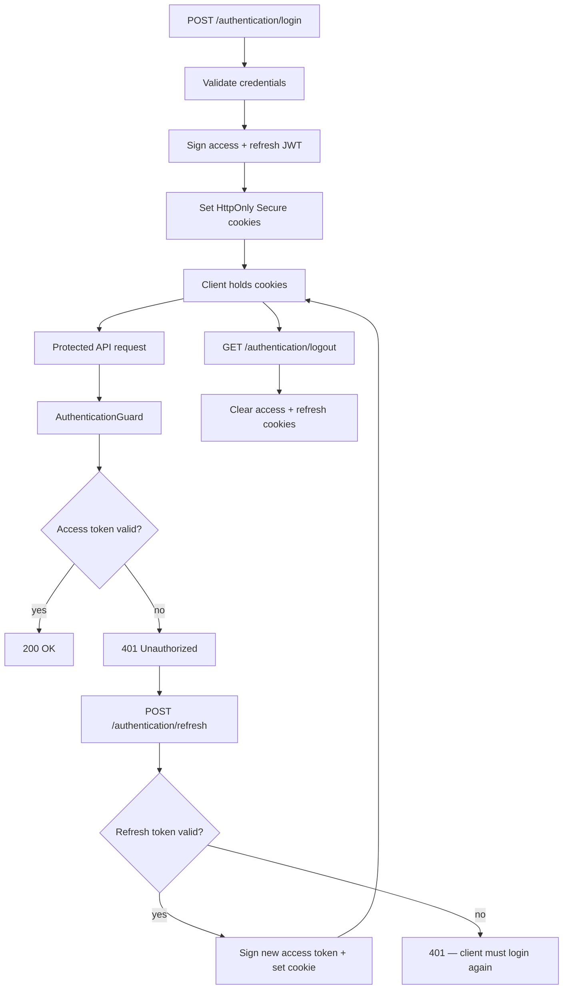
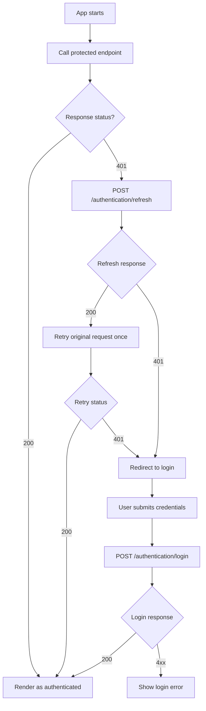

# Authentication tokens (cookie-based JWT)

This backend uses **two JWTs** delivered as HTTP-only cookies:

| Role | Purpose |
|------|---------|
| Access token | Short-lived; validated on protected routes |
| Refresh token | Long-lived; used only to obtain a new access token |

Implementation lives under `src/users/authentication/`, `src/users/guards/authentication.guard.ts`, and JWT registration in `src/users/users.module.ts`.

## Endpoints

| Method | Path | Behavior |
|--------|------|----------|
| `POST` | `/authentication/login` | Validates credentials; sets **access** and **refresh** cookies |
| `POST` | `/authentication/refresh` | Reads refresh cookie; verifies it; sets a new **access** cookie (refresh cookie unchanged in the current stateless design) |
| `GET` | `/authentication/logout` | Clears **both** cookies |

Responses use empty bodies where applicable; tokens are in cookies only.

## Protected routes

`AuthenticationGuard` reads the **access** cookie name from `ACCESS_COOKIE_NAME` and verifies the JWT with `ACCESS_TOKEN_SECRET`.  
If the access token is missing, invalid, or expired, the request returns **401 Unauthorized**. Clients should then call `/authentication/refresh` and retry.

## Environment variables

Cookie names and secrets must be set explicitly (`configService.getOrThrow`). See `.env.sample` for placeholders:

- `ACCESS_COOKIE_NAME`, `REFRESH_COOKIE_NAME`
- `ACCESS_TOKEN_SECRET`, `ACCESS_TOKEN_TTL`
- `REFRESH_TOKEN_SECRET`, `REFRESH_TOKEN_TTL`

## Backend flow



## Frontend flow (SvelteKit + `fetch`, client-only)

The intended setup here is **no SSR for API auth**: the browser talks to the API through a **same-origin path** (reverse proxy in production, Vite dev proxy in development). Nest typically **does not need CORS** in that layout because the SPA and API share one browser origin; the proxy forwards requests to the Nest host internally.



## Security model (stateless refresh)

- **Pros**: Simple; no refresh-token persistence or rotation logic in the database.
- **Cons**: Individual refresh tokens cannot be revoked server-side without broader measures (e.g. secret rotation). For stronger revocation and replay protection, consider **rotating, stateful** refresh tokens stored hashed per session.

## Cookies vs access/refresh tokens (same workflow)

Using **cookies does not replace** the access/refresh design — cookies are how the browser **stores and sends** those JWTs.

- **Access token** and **refresh token** are still two distinct JWTs with different lifetimes and verification keys on the server.
- Putting them in **HttpOnly cookies** means JavaScript cannot read them easily (better vs XSS + `localStorage`). The server still validates JWT claims and expiry exactly as it would for an `Authorization: Bearer` token.

So the workflow remains: short-lived access JWT for normal calls, long-lived refresh JWT only for `/authentication/refresh`; cookies are the transport, not a separate “session-only” login mechanism unless you choose to treat them that way.

## SvelteKit integration

### Same-origin proxy (recommended)

| Environment | Typical setup |
|-------------|----------------|
| Development | Vite `server.proxy` so `/api` (or similar) forwards to Nest |
| Production | NGINX (or similar) reverse proxy: one public host/path serves the SPA and proxies API routes to Nest |

The browser should call the API with URLs that are **same-origin** with the SvelteKit app (e.g. `fetch('/api/users')`). Then cookies set by Nest on responses are **first-party** for that origin and are sent automatically on subsequent same-origin `fetch` calls.

You normally **do not enable CORS** on Nest for this pattern because the browser never makes a cross-origin XHR to Nest — only the proxy talks to Nest server-to-server.

### `fetch` and `credentials`

For **same-origin** requests, `fetch` defaults to `credentials: 'same-origin'`, which **already sends cookies** for that origin. You do **not** need `credentials: 'include'` unless you intentionally call the API on a **different origin** with credentialed cross-origin requests (that scenario implies CORS configuration on the API).

Avoid `credentials: 'omit'` — that would strip cookies.

### Browser-only example (`fetch`)

Use relative URLs when the proxy maps them to Nest:

```typescript
await fetch('/api/authentication/login', {
  method: 'POST',
  headers: { 'Content-Type': 'application/json' },
  body: JSON.stringify({ email, password }),
});
```

### Refresh-on-401 helper (`fetch`)

Keep refresh **single-flight** so parallel requests do not trigger multiple refreshes. Same-origin cookie behavior applies without setting `credentials` explicitly:

```typescript
let refreshPromise: Promise<Response> | null = null;

function refreshSession(): Promise<Response> {
  if (!refreshPromise) {
    refreshPromise = fetch('/api/authentication/refresh', { method: 'POST' }).finally(() => {
      refreshPromise = null;
    });
  }
  return refreshPromise;
}

export async function apiFetch(input: string, init: RequestInit = {}): Promise<Response> {
  const response = await fetch(input, init);

  if (response.status !== 401) return response;

  const refreshed = await refreshSession();
  if (!refreshed.ok) throw new Error('unauthenticated');

  return fetch(input, init);
}
```

Adjust `/api` to match your proxy prefix.

### Notes

- Do not duplicate JWTs in `localStorage` if they remain HttpOnly in cookies.
- After **401**, refresh once and retry the original request once; if refresh returns **401**, send the user to login (client-side navigation).
